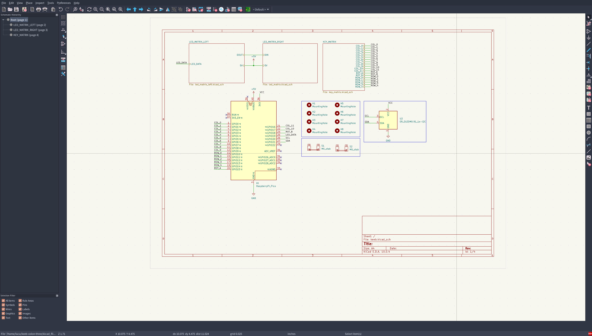
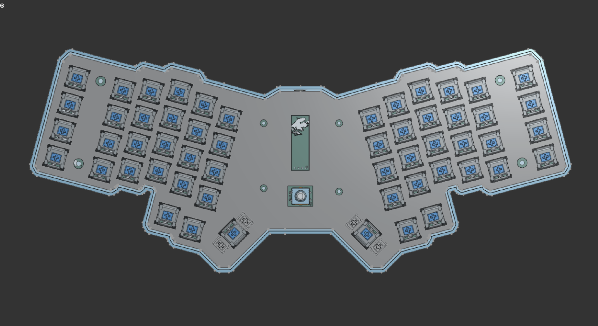
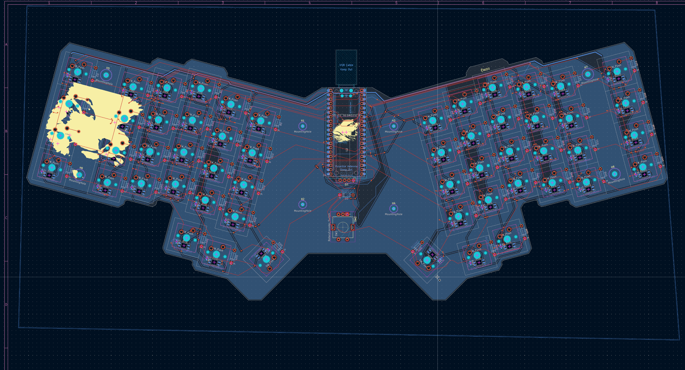
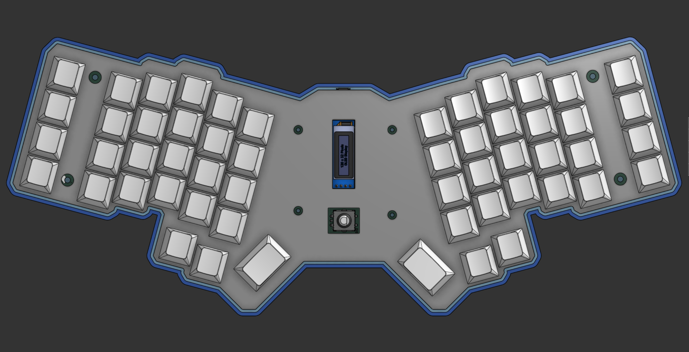

# Welcome to my journal!

### This file will contain dated images and screenshots of my work, alongside my current thoughts on the project. Please don't mind any spelling/grammar errors I may make, I'll probably correct them as I go. 

#### *For all KiCAD related commits, I forgot to track my time, but it's safe to assume around 2-3 hours of actual work and another 1-2 hours of fighting with KiCAD :P I will give a more accurate estimate if I clearly remember something taking a looot of time* 

## 06/07/2026
Hehe 67. I made around 80% of the keyboard layout schematic, will complete and add LEDs and an oled tomorrow, but I just HAD to log something on 06/07.

Screenshot:

## 07/07/2026
Decided to do a full overhaul of the layout. Seems mostly done, i'll probably add rbg and other stuff in the following days, ik I promised to do more today, but yk, life n stuff.

Screenshot:

## 09/07/2026
Trying to figure out what to do with the LED's and OLED, if I don't write anything else today, it's safe to assume i passed out at my desk :P

## 10/07/2026
Back from the dead! Split the schematic into multiple sheets, and added RGB. If everything is alright, I'll do the pcb soon. 

Screenshots:

## 13/07/2026
So, last week was cooked :P. Schematic is done, unless I or someone else find some flaw within it. PCB should be done...sometime in the near future.

Screenshot:

## 15/07/2026
Added footprints, not much to screenshot tbh

#### Same day, 22:05

Started on the pcb, will finish layout+ add edge cuts+ route these following days, but right now I know that if I continue at my current state I'll just mess something up and ruin the whole build :P

Screenshot:

## 18/07/2026
Est: <mark> 4.5~5.5 hours </mark>

Honestly, most of this time was spent learning kicad in general, did almost all the pcb except for routing, now ensuring that everything is fine before completing the pcb.

**06/08** Update: Somehow completely glossed over these things but:
* Edge cuts were done manually, and painstakingly. Those most definitely took the most time. 
* <mark>R</mark> and <mark>Shift+R</mark> were rebound to rotate +15 and -15 deg. respectively

Screenshot: 

## 19/07/2026
Est: <mark> 3.5 hours </mark>
First time routing a pcb, hopefully not as bad as it looks! Keyboard matrix is done, now I have to supply power and ground to the rgb circuitry.

Screenshot:

## 21/07/2026

Est: <mark> 4 hours </mark>
I honestly feel defeated, but maybe I'll regain my clarity tomorrow. Routing is....kinda bad, and I don't think I can avoid using 4 layers, but maybe that's just the tiredness speaking. Idk what possesed me to make this my first pcb but I shall persist.

Screenshot: 

## 23/07/2026
Est: <mark> 5 hours </mark> 
PCB is done. Tracks are ~very~ kinda ugly, but it is my first keyboard so. Also added some stuff on the silkscreen.

Screenshots:

## Note: I will be away from home until 31/07/2026, so probably no updates until August, unless I decide to talk about my orders. Also ordered my pcb, will post pics once it arrives :D

## 01/08/2026
I'm back! Started working on the case now! From now on, I'll also post the time at which I'll start and stop working, to make it easier for the reviewer to estimate my time spent on this project. All time stamps are at **UTC+3 EEST**

**17:30** Started making the base of the keeb.

**19:01** Made the baseplate, will add screwmounts after a (hopefully not that long) break.
Screenshot:

## 02/08/2026
Started at **15:15**, finishing the baseplate

**15:57** Added cylinders for heat set inserts.

**16:33** Added walls and a hole for the usb port.

Screenshots:

 

## 03/08/2026
Started at **15:33**, making the plate. Now, how am i supposed to make the holes for the switches with a layout like mine....

**16:49**: Yeah I still have no idea how to do this part tbh... might be stuck here for a while :P Also, one of the stabilizers is on backwards, as in the depths of my foolishness, I had ordered the pcb before applying for a grant and have no money to repair my mistake. Oh well, my already existing keyboard has no stabs for it's 2u keys so i guess it's fine.... :(

**16:59**: I might be able to do something with the svg export, hmm.

**18:56**: Ok, so, i did it! The way I did it was exporting the F.Courtyard layer as an svg, converting to a dxf, importing that dxf as a sketch, making a new sketch based only on the lines I need (edge cuts, witch, screw mount, rotary encoder and oled holes), and only then, FINALLY extruding it. Also realized I need to make the walls thinner, brb.

**19:15**: Thinned out the walls, I'll clean up the model later today or tomorrow, so that I can get a nice screenshot for my readme. Also need to make an actual good readme file :P

Screenshot: 

## 05/08/2026
Starting at **18:47**, doing some cleanup. Also, forgot to log this but I raised the case walls yesterday so that they now peek above the plate. Removed stabilizers from pcb and schematic, as they will not be used in my finalized keyboard.  

Screenshot:

## 06/08/2026
Starting at **9:40**

Had to leave after like an hour of work yesterday, whoops :P. Making a more presentable model for the readme file, finishing the case model, awaiting feedback on my journal and case/plate models, and fixing mistakes in my journal, such as missing images, or comments that I wrote down but did not add to my journal. Also added time estimates to a few commits.

The first ever screenshot does seem to be permanently gone tho :(. If everything goes right, I might be able to finally submit my keeb!!!.

Also, the PCBs arrived two days ago, no pictures because I'm not unsealing them until I get the rest of the parts.

**12:25**
* Finished cleaning up the journal.
* Finished the case and plate
* Finished clening up the pcb model.

Screenshot:

Took a break, restarted at **16:00**

**17:14**

* Writing this very journal entry!
* Made my readme
* Uploaded step models to the repo
* Finishing up for project submission (!!!!)

### ~This is my final commit before submitting. For whoever cares, I will continue to journal my build process once I get the grant and all of the parts :)~

**18:42**
Guess we making firmware now

Also, I only have 54 keys, where did I get 56 from lmao

**19:15**
Aaaaand the rotary encoder has the EXACT same row and column as another key, so I either reorder the pcb and take the L, live without a push button , or bind mute/unmute to some key in the thumb row. AARGHHHHHHHH 

**20:15**
Finished a basic keymap, not final, as i obviously....do not have the keyboard to try it out on. Also gave the rotary encoder a "job" to do.

**20:35**
Yeah, probably not adding rgb and oled support until I receive the parts and solder everything, gotta make sure the firmware at the very least functions before going into uncharted territory. I guess this is it then... gotta correct the readme then I'm good to go!
