# Welcome to my journal!

### This file will contain dated images and screenshots of my work, alongside my current thoughts on the project. Please don't mind any spelling/grammar errors I may make, I'll probably correct them as I go. 

## 06/07/2026
Hehe 67. I made around 80% of the keyboard layout schematic, will complete and add LEDs and an oled tomorrow, but I just HAD to log something on 06/07.

Screenshot:
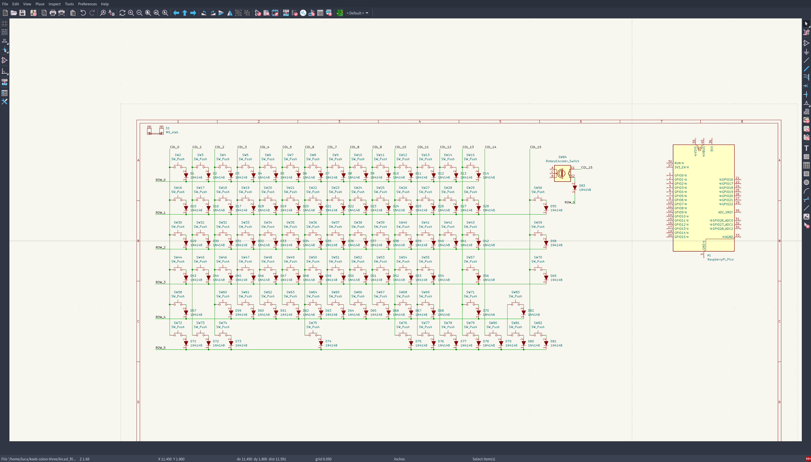

## 07/07/2026
Decided to do a full overhaul of the layout. Seems mostly done, i'll probably add rbg and other stuff in the following days, ik I promised to do more today, but yk, life n stuff.

Screenshot:
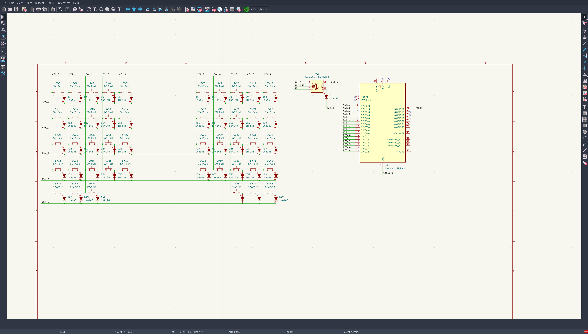

## 09/07/2026
Trying to figure out what to do with the LED's and OLED, if I don't write anything else today, it's safe to assume i passed out at my desk :P

## 10/07/2026
Back from the dead! Split the schematic into multiple sheets, and added RGB. If everything is alright, I'll do the pcb soon. 

Screenshots:
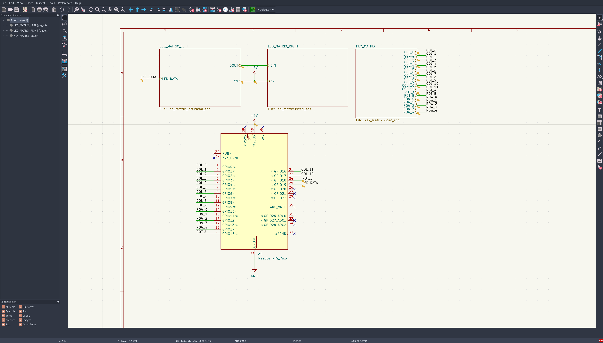
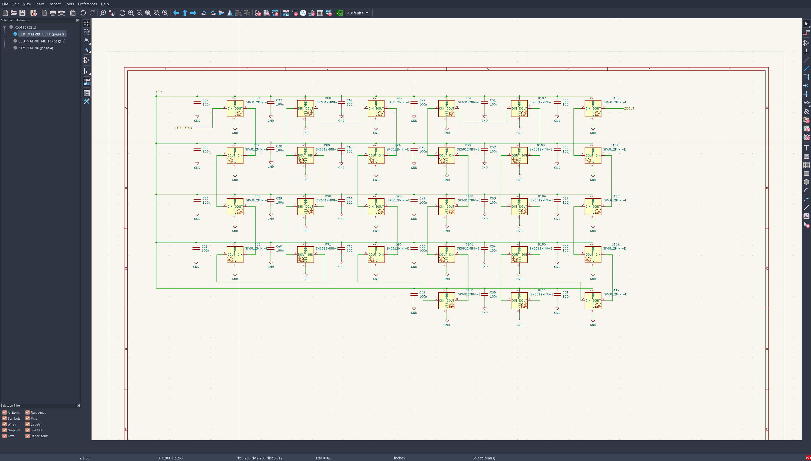
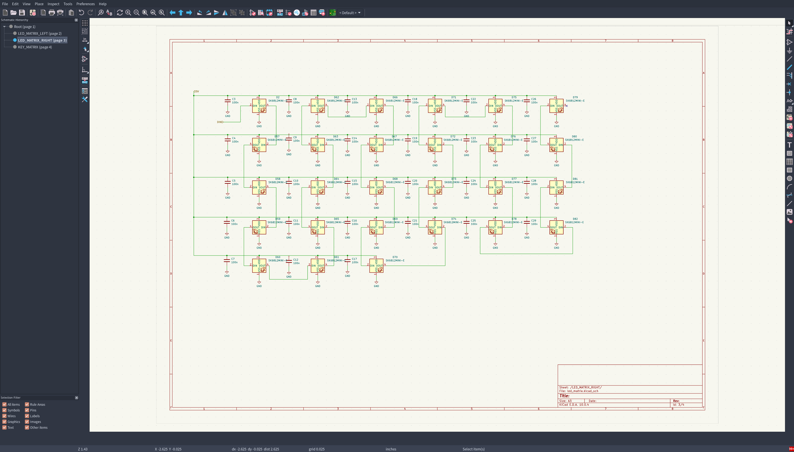
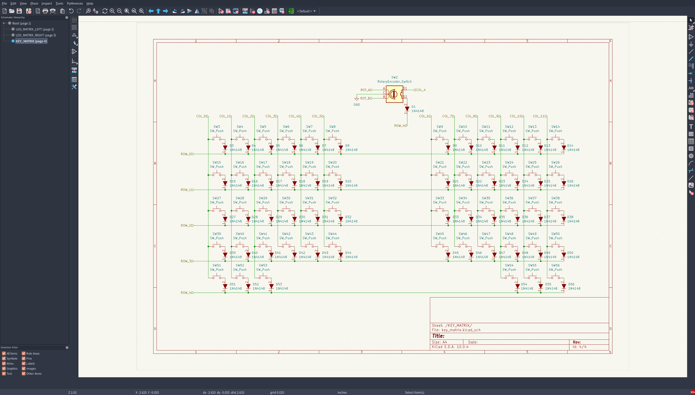

## 13/07/2026
So, last week was cooked :P. Schematic is done, unless I or someone else find some flaw within it. PCB should be done...sometime in the near future.

Screenshot:

## 15/07/2026
Added footprints, not much to screenshot tbh

#### Same day, 22:05

Started on the pcb, will finish layout+ add edge cuts+ route these following days, but right now I know that if I continue at my current state I'll just mess something up and ruin the whole build :P

Screenshot:

## 18/07/2026

Honestly, most of this time was spent learning kicad in general, did almost all the pcb except for routing, now ensuring that everything is fine before completing the pcb.

Screenshot: 
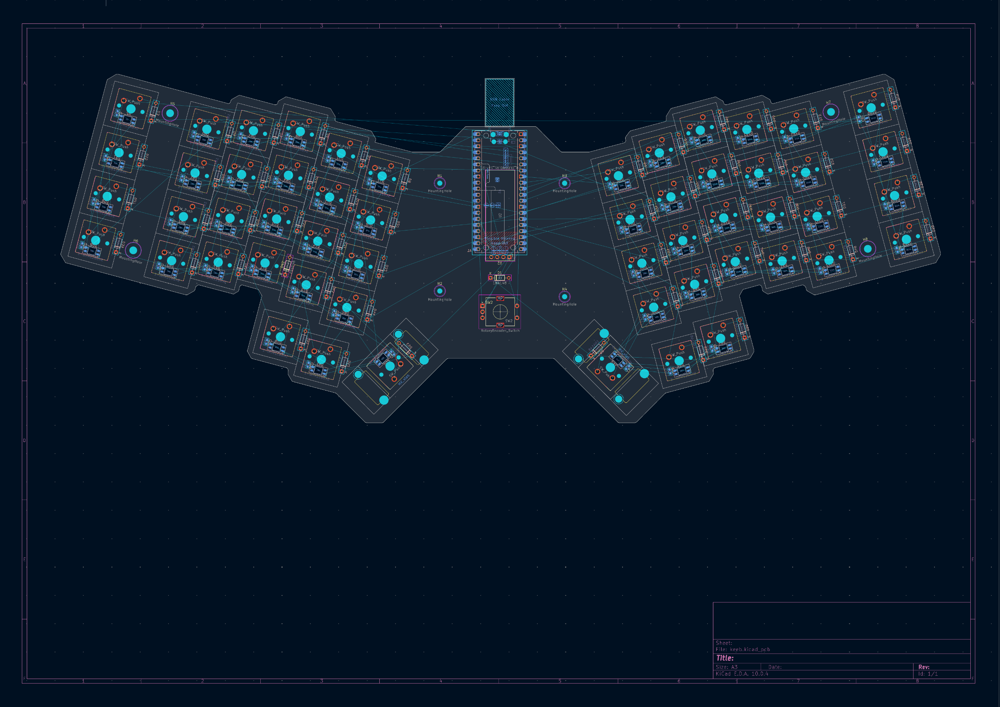

## 19/07/2026
First time routing a pcb, hopefully not as bad as it looks! Keyboard matrix is done, now I have to supply power and ground to the rgb circuitry.

Screenshot:
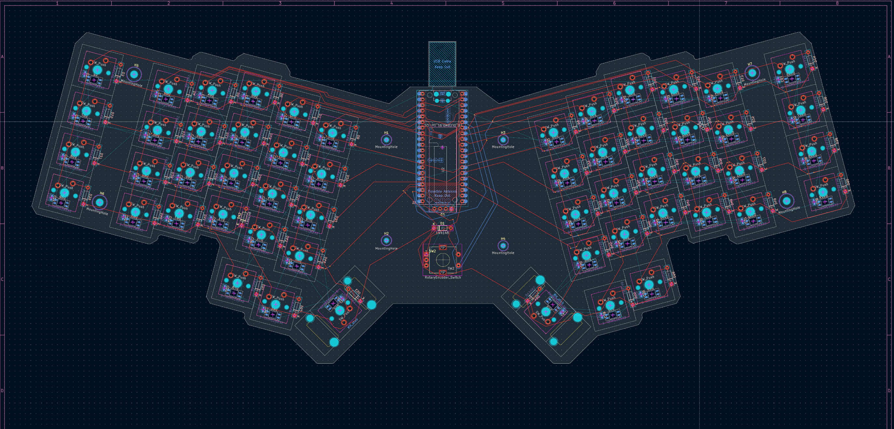

## 21/07/2026
I honestly feel defeated, but maybe I'll regain my clarity tomorrow. Routing is....kinda bad, and I don't think I can avoid using 4 layers, but maybe that's just the tiredness speaking. Idk what possesed me to make this my first pcb but I shall persist.

Screenshot: 
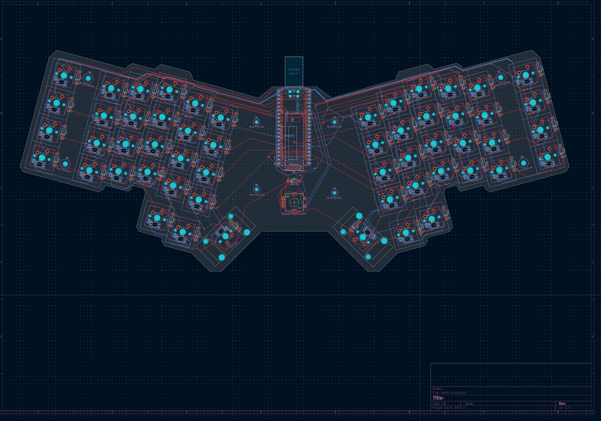

## 23/07/2026
PCB is done. Tracks are ~very~ kinda ugly, but it is my first keyboard so. Also added some stuff on the skilscreen.

Screenshots:
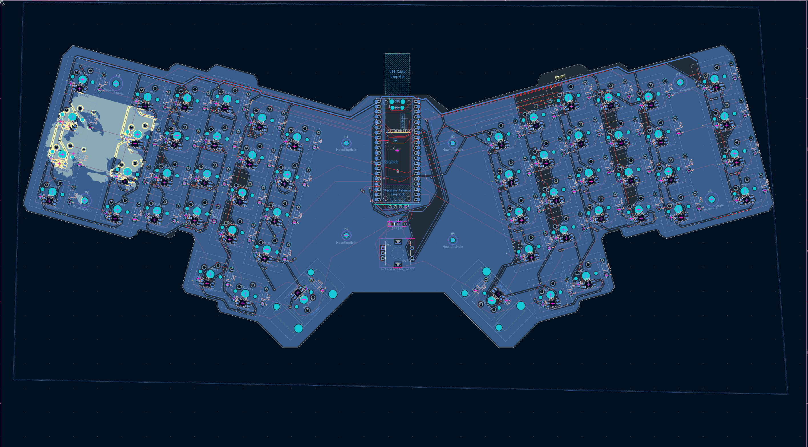
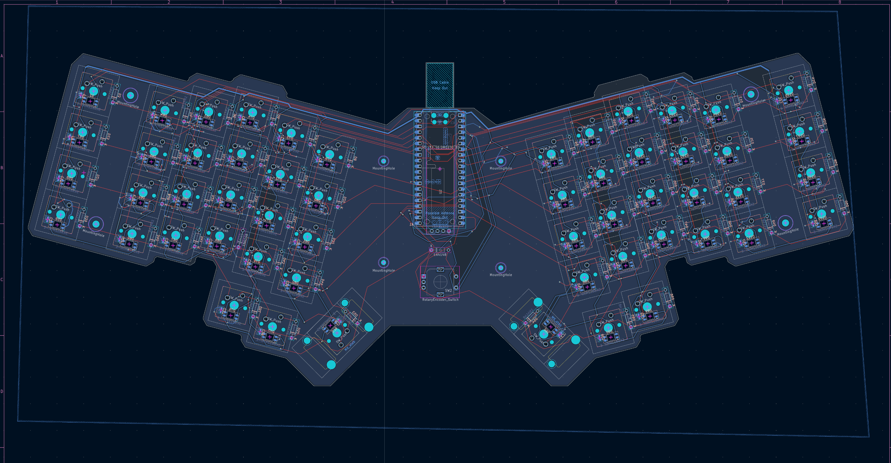

## Note: I will be away from home until 31/07/2026, so probably no updates until August, unless I decide to talk about my orders. Also ordered my pcb, will post pics once it arrives :D

## 01/08/2026
I'm back! Started working on the case now! From now on, I'll also post the time at which I'll start and stop working, to make it easier for the reviewer to estimate my time spent on this project. All time stamps are at **UTC+3 EEST**

*For all previous commits, assume around 1-3 hours of actual work and another 2-3 hours of learning how kicad works :P* 

**17:30** Started making the base of the keeb.

**19:01** Made the baseplate, will add screwmounts after a (hopefully not that long) break.
Screenshot:
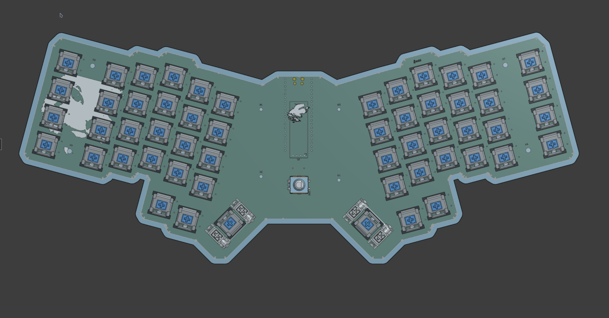

## 02/08/2026
Started at **15:15**, finishing the baseplate

**15:57** Added cylinders for heat set inserts.

**16:33** Added walls and a hole for the usb port.

Screenshots:
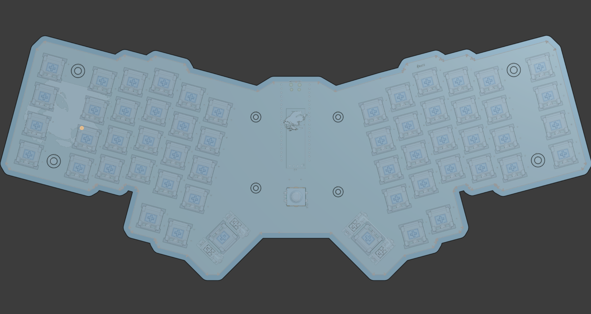
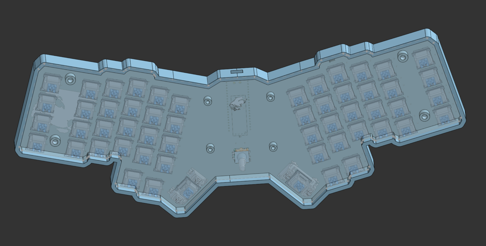 
