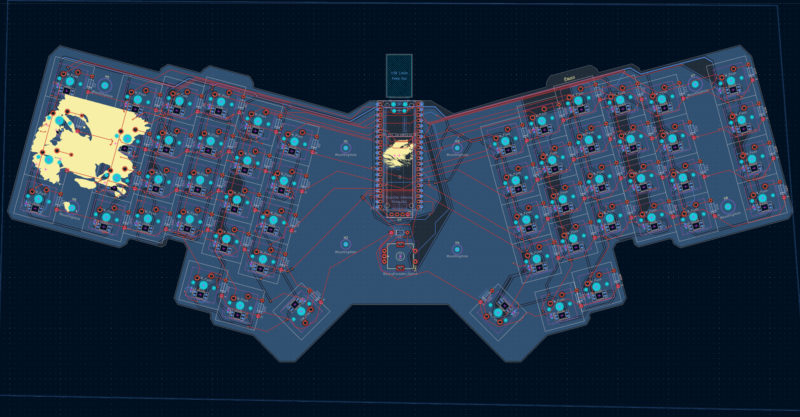

# keeb-colon-three 
A fully custom 56-key mechanical keyboard, designed from the ground up, including: PCB, case, plate (No assembly yet, and, as such, no firmware either). This project was built to learn the entire keyboard design process, as well as to familiarize myself with the neccesary tools and software.

## Features:
* 56 key custom ergonomic layout
* MX compatible switches
* Per Key RGB
* Rotary Encoder
* 3D printed tray mount case and plate
* 128x32 OLED display

## Why I designed it
Depending on when in the design process I'd ask myself this, I'd get fairly different answers: Because one mechanical keyboard is not enough, because I want to test my patience, because I enjoy suffering. However, beyond all these rather superficial answers, there is one clear truth poking it's head out:

I want to build something meaningful myself. 

This project has given me the opportunity to refine my pcb design, and to learn CAD modelling, manufacturing, and soon enough, soldering (especially tiny smd components, such as the LEDs and caps) and firmware configuration.

## Design Process
The project began quite simple, being a basic 60% keyboard. However, it soon devolved into a split layout (kinda) ergonomic keyboard, featuring rgb, an ec11 and a display module. I designed the PCB in kicad, and routed everything myself, adding a ground copper fill at the end. After that, I designed a relatively simple tray mount case around the PCB, and a plate traced over the F.Courtyard layer of the board.

## Components
* Custom PCB
* Raspberry Pi Pico (or any footprint compatible rp2040 based board)
* MX-compatible switches
* 3D printed case
* 3D printed or cnc machined plate
* Keycaps
* SK6812 mini-e
* EC11 rotary encoder
* 128x32 OLED display

* All other components mentioned in the bill of materials

## What I learned, what I struggled with.
While I go into way more detail of my struggles in my journal, by far the most difficult parts for me were:

* Designing the case around the board's shape
* Routing while forcing myself to **NOT** use a 4 layer PCB
* Fixing DRC errors that made no sense, such as solder pads existing in their own keepout zones.

What I've learned: 

* PCB design
* Routing
* Basic CAD skills
* How to not lose focus on longer projects
* Miscellaneous KiCAD-related skills.

What I will learn, once (if) I receive a grant and obtain everything needed for the completed keeb:

* Soldering tiny components
* Firmware configuration and design.
* A bit of rust :P
